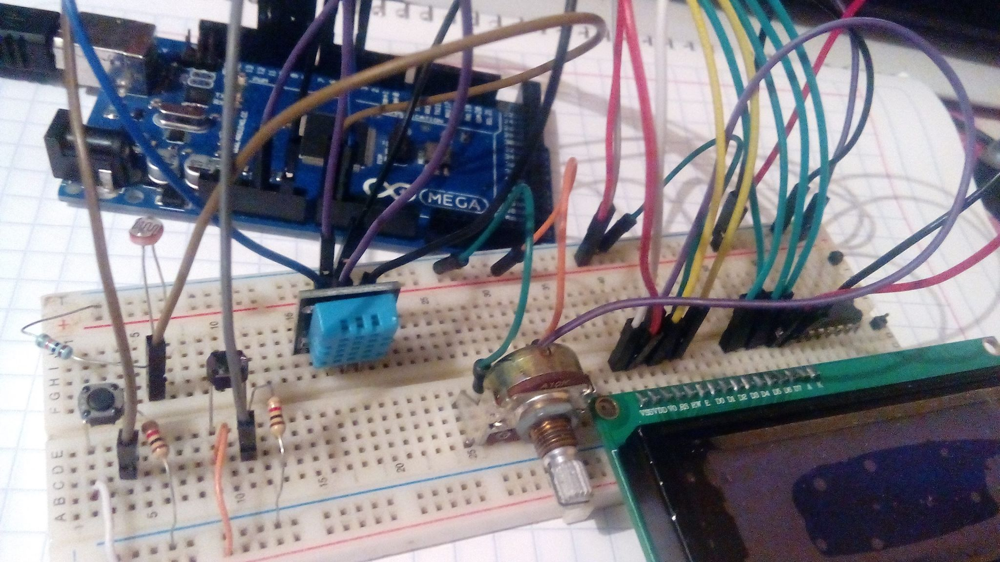
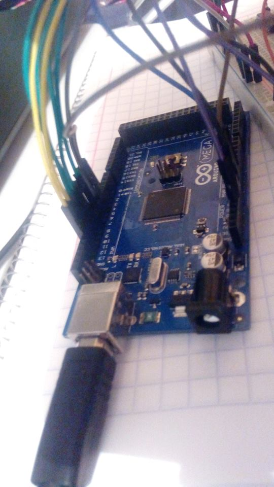

# Sistema-Notificador-de-Mensajes

## Descripción del proyecto

El presente proyecto consiste en un sistema que nos permita almacenar mensajes de máximo 140 caracteres. Los mensajes serán desplegados
en una pantalla LCD junto con la fecha y hora en la que fueron emitidos. La pantalla además desplegará un reporte del clima actual
que incluye la temperatura (en grados centígrados), la humedad y la luminosidad (ambas en porcentaje).

Será posible utilizar hardware para visualizar en la pantalla LCD todos los mensajes que han sido emitidos.

El proyecto incluye además una interfaz de software que nos permite generar nuevos mensajes y eliminarlos.

## Información general de los autores

> **Universidad:** Instituto Tecnológico de León
>
> **Carrera:** Ingeniería en Sistemas Computacionales
>
> **Materia:** Sistemas Programables
>
> **Periodo:** Agosto-Diciembre 2018
>
> **Profesor:** Ing. Levy Rojas Carlos Rafael
> 
 ### Integrantes:
 * Campos Magallanes Ana Luisa - [AniluCampos](https://github.com/AniluCampos)
 * Dávalos Romero Daniel - [MrDanii](https://github.com/MrDanii)
 * Esparza Guevara Nestor Paul - [PaulEsparza](https://github.com/PaulEsparza)

## Pre-requisitos 
### Materiales
> * Protoboard
> * Arduino MEGA
> * Display LCD 20x4
> * Potenciómetro
> * Sensor de temperatura
> * Sensor de luminosidad
> * Sensor de humedad DTH11
> * 2 Push buttons
> * 2 Resistencias de 1K ohms
> * 1 Resistencia de 10K ohms
> * Cables
 
 ### Librerías
 **Versión 3.0.0 del API PanamaHitek_Arduino ()** - disponible [aquí](https://github.com/PanamaHitek/PanamaHitek_Arduino/releases/tag/3.0.0)
 
 **LiquidCrystal** - disponible [aquí](https://playground.arduino.cc/Main/LiquidCrystal#Download)
 
 **DHT-sensor-library** - disponible [aquí](https://github.com/adafruit/DHT-sensor-library)
 
 ## Procedimiento
 
 **1. Armar el prototipo siguiendo el siguiente diagrama**
 

 Resultados

 
 
 
 **2. Importar las librerias en los IDE correspondientes**
 
 **3. Descargar y ejecutar los códigos en las clases correspondientes**

 >Abrir el archivo [HumedadTemperaturaLCD.ino](https://github.com/MrDanii/Sistema-Notificador-de-Mensajes/blob/master/HumedadTemperaturaLCD/HumedadTemperaturaLCD.ino) en el IDE de Arduino y ejecutarlo.
 
 >Compilar el proyecto java [Sistema Notificador de Mensajes Java](https://github.com/MrDanii/Sistema-Notificador-de-Mensajes/tree/master/Sistema%20Notificador%20de%20Mensajes%20Java) y ejecutar la clase LanzadorMenu.java ubicada en
    src/display/LanzadorMenu
